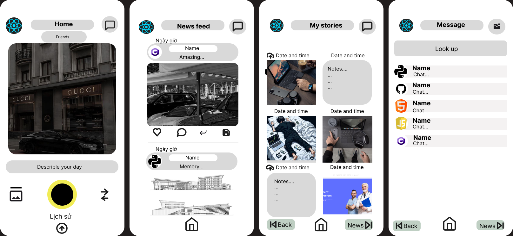

# LoketNotes
Project with real-time image and note sharing functionality: 
Users can share the current image, at the time of taking the photo, the system will save and share it to the user community, including notes. When there is no network, the system still works by saving on the cloud, then when the user has network, it will automatically synchronize.

